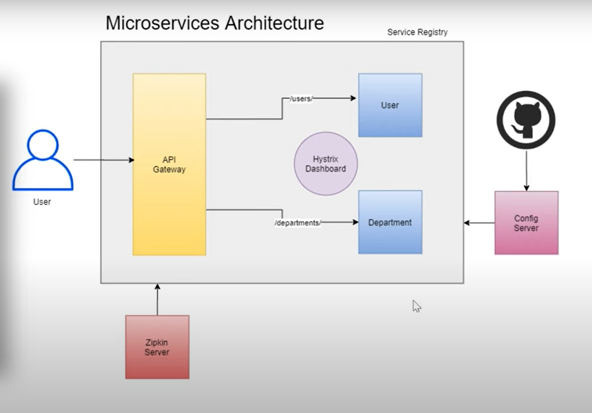
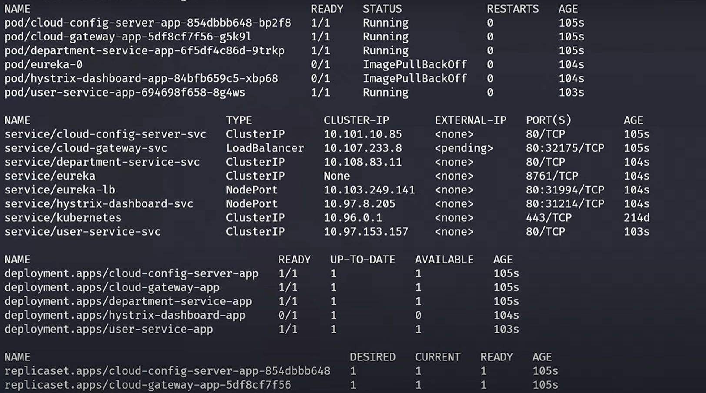
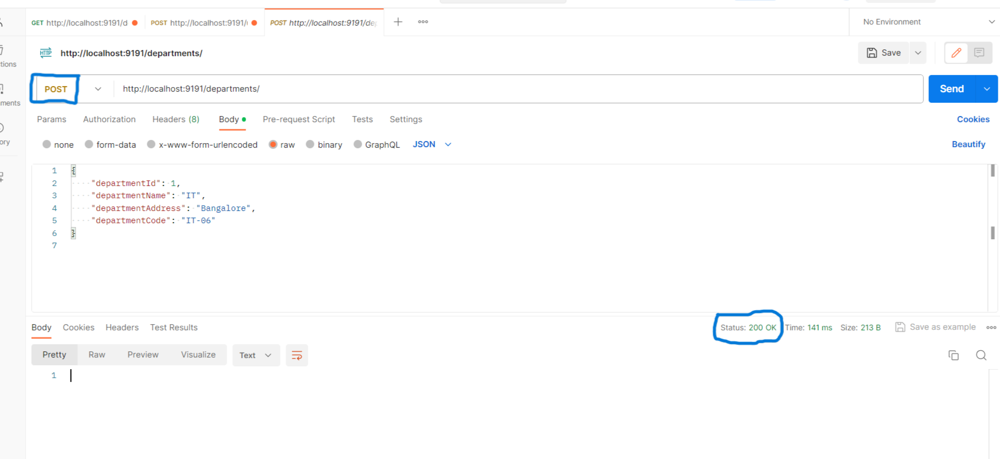
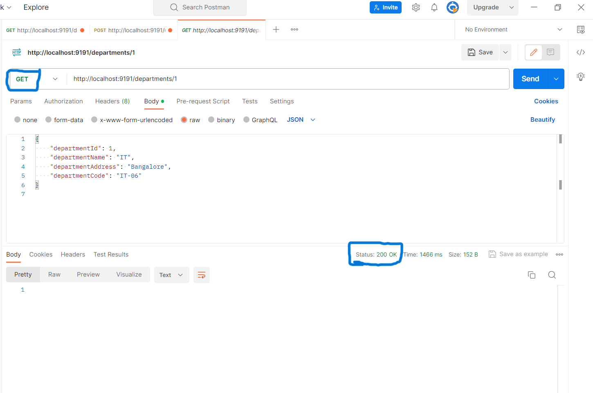

# Microservice Application Deployment Guide

A user management application, developed using `Springboot` framework that consists of following microservices:
- **cloud-config-server**
- **cloud-gateway**
- **department-service**
- **hystrix-dashboard**
- **service-registry**
- **user-service**

## Microservice Architecture
In a microservices architecture, services interact with each other through well-defined APIs. Here's a brief overview of how the services in your setup might interact:

#### Service Registry (Eureka or similar):
The service-registry is responsible for service discovery. Each microservice registers itself with the service registry upon startup. This allows other services to dynamically discover and communicate with it.
When a microservice (user-service or department-service) starts, it registers itself with the service-registry.

#### API Gateway (cloud-gateway):
The cloud-gateway serves as an entry point for external clients and also acts as an API gateway for internal microservices.
Requests from external clients first go through the cloud-gateway. The gateway can handle authentication, load balancing, and routing to the appropriate microservice based on the request.

#### Configuration Server (cloud-config-server):
The cloud-config-server centralizes configuration settings for all microservices. Each microservice can fetch its configuration from this server during startup.
Microservices query the cloud-config-server to get their configuration settings, allowing for centralized configuration management.

#### User Service (user-service) and Department Service (department-service):
These services are responsible for managing user and department data, respectively.
They expose APIs that can be called by other services or the API Gateway.
For example, the user-service might expose endpoints like /users/{userId} for retrieving user details.

#### Hystrix Dashboard (hystrix-dashboard):
Hystrix is used for circuit breaking and monitoring service resilience.
The hystrix-dashboard provides a visual representation of Hystrix metrics, allowing you to monitor the health and performance of your services.
Each microservice might have Hystrix annotations to define fallback methods and circuit breaker behavior.

### Request Flow Example:
- An external client makes a request to the API Gateway (cloud-gateway).
- The API Gateway forwards the request to the appropriate microservice based on routing rules.
- The microservice queries the Service Registry (service-registry) to discover the location (IP and port) of the target microservice.
- The microservice makes an internal HTTP request to the target microservice's API to fulfill the request.
- If needed, the microservice might fetch configuration settings from the Configuration Server (cloud-config-server).
- Hystrix metrics are collected during the process, and the results can be monitored through the Hystrix Dashboard.



## Application Deployment

**Prerequisites**
Before proceeding with deployment, ensure the following prerequisites are met:

- A running Kubernetes cluster.
- Docker installed on your local machine for building Docker images.
- Access to a container registry (e.g., Docker Hub, Google Container Registry) to store Docker images.

## Steps to Deploy
**1. Containerize Microservices**
For each microservice, create a Dockerfile and build the Docker image. Example:
```
docker build -t <service-name>:<tag> .
```

**2. Push Docker Images**
Tag and push Docker images to the container registry
```
docker tag <service-name>:<tag> <registry-url>/<username>/<service-name>:<tag>
docker push <registry-url>/<username>/<service-name>:<tag>
```

**3. Kubernetes Deployment**
Go to the `miroservice-k8s-manifest` Directory and configure yaml files accordingly like chnaging the image names.
```
kubectl apply -f ./
```
This command will create all the resources defined in the directory simulteneously.

To verify the resources
```
kubectl get all
```


## Services
As for as services are concerned, I've created service of type **ClusterIP** for internal communication whereas  API Gateway is associated with **LoadBalancer** type of service, responsible for traversing the external request to corresponding microservices. For Hystrix Dashboard, **NodePort** service has been created.

Additionally, pod for `service-registry` was created using **StatefulSet** instead of**Deployment** to keep a unique and stable identity in the form of a hostname, which is based on the name of the StatefulSet and the pod index. This makes it easier to maintain a consistent identity for the Service Registry, aiding in service discovery. When creating StatefulSets we need to use  ***headless services***, which means that each pod has its own DNS or Endpoint entry. Headless Services don't create any IP Address. This is useful for scenarios where you need to perform DNS-based service discovery, which is common in Service Registries.

Once Microservices are deployed in kubernetes cluster, we need to do port-forwarding of the services to access it externally.

Forwarding port of `cloud-gateway-svc` to access it from **Postman** to insert data in Application
```
kubectl port-forward services/cloud-gateway-svc 9191:80
```
Now you can access application using http://localhost:9191/departments url to hit **POST and GET** request.




